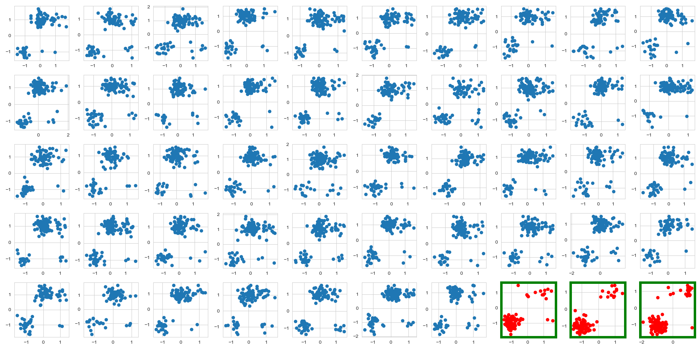
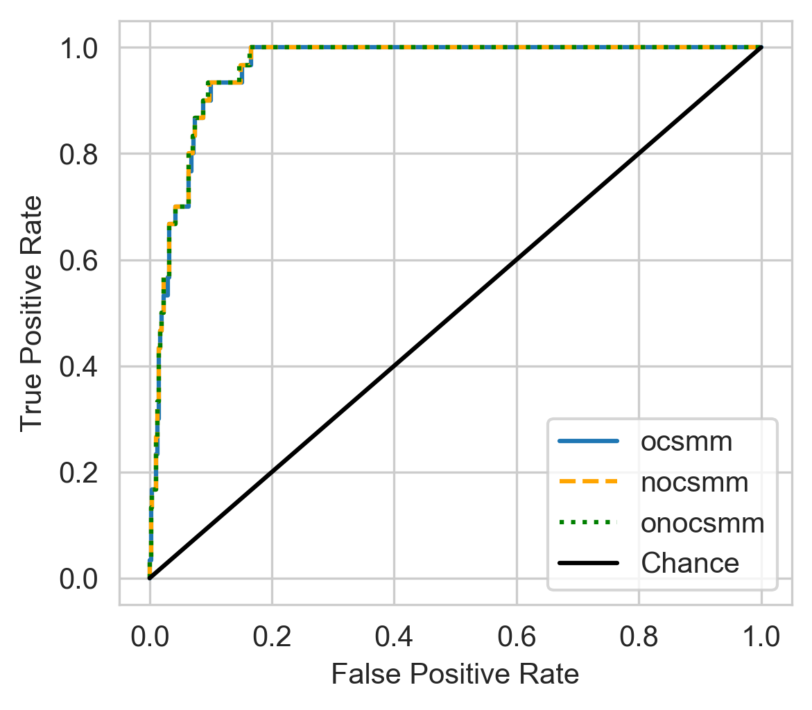
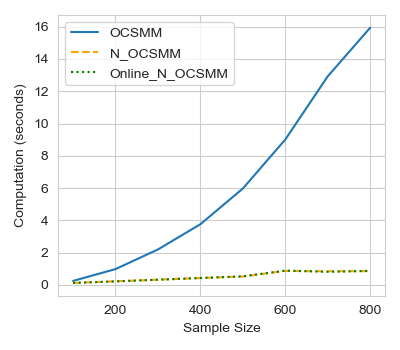
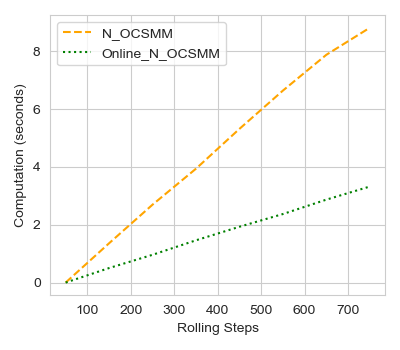

# FAST, EFFICIENT One Class Support Measure Machines

Repository intended to explore a fast and memory efficient implementation of One Class Support Measure Machines (OCSMM).
Ideas from these papers are explored:
1. [One-Class Support Measure Machines for Group Anomaly Detection, 2013, Proceedings of the Twenty-Ninth](https://arxiv.org/abs/1408.2064)
2. [Large Scale Online Kernel Learning. Journal of Machine Learning Research 2016](http://www.jmlr.org/papers/v17/14-148.html)

<p float="center">
  
</p>

<p float="center">
  
   
   
</p>

# Conda environment
```console
local_user@local_host$ bash setup.sh
```

# Run OCSMM experiments
```console
local_user@local_host$ python src/utils_experiment.py
local_user@local_host$ jupyter notebook src/group_outlier_detection.ipynb 
```
